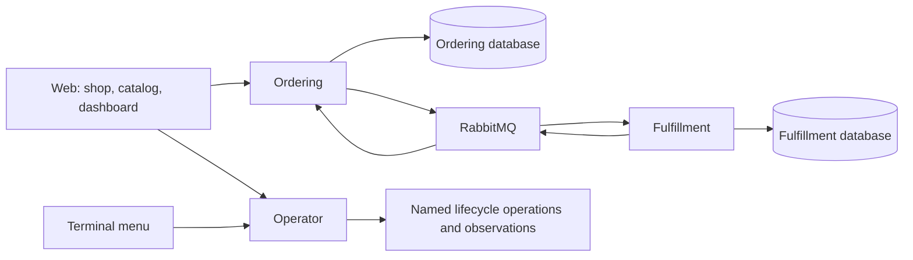
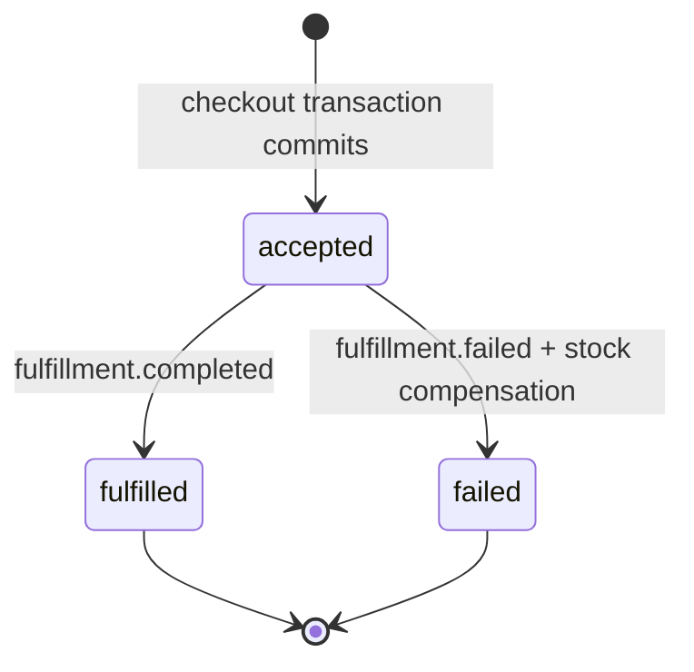
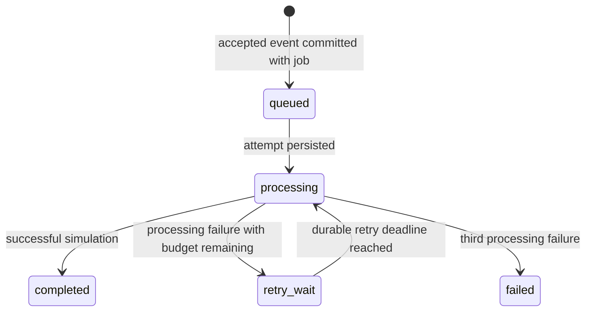

# Group 1: one order, four applications

This lab teaches the path from a browser submission to a transaction, durable event, processing attempt and observable outcome. Everything is fictional. There is no signup, payment, carrier integration, or production deployment. A monorepo is one source repository; it does not imply one runtime process or shared database ownership.

| Workspace          | Owns                                                                                     | Interface and guarantees                                                                           |
| ------------------ | ---------------------------------------------------------------------------------------- | -------------------------------------------------------------------------------------------------- |
| apps/web           | Anonymous browser identity, saved unresolved checkout, presentation                      | Shared-contract fetch wrapper; one transient read retry; mutations are never automatically retried |
| apps/ordering      | Products, carts, orders, accepted idempotency results, own outbox/inbox                  | REST CRUD and checkout; no fulfillment-table access                                                |
| apps/fulfillment   | Settings, jobs, attempts, own outbox/inbox                                               | Accepted-event consumption, durable processing and outcome events; no ordering-table access        |
| apps/operator      | Named actions and local host observations                                                | Serial control actions with IDs, progress and requested/started/finished times                     |
| packages/contracts | JSON schemas and transport types                                                         | Runtime validation and generated OpenAPI/event documentation                                       |
| packages/runtime   | Configuration, database transactions, broker delivery, structured activity and telemetry | Shared capabilities; business rules remain inside their owning applications                        |
| packages/client    | Browser request behavior                                                                 | Native fetch, response contract validation, bounded read retry and explicit unknown write outcomes |
| tools              | Migrations, seed, CLI, controlled lifecycle, contract export                             | Uses named services; generated runtime state lives under .lab/                                     |

## Checkout and state machines

A preview observes the cart revision, current product prices, availability and a sorted price fingerprint. It reserves nothing. Acceptance locks the cart, looks for a previously accepted idempotency result, then locks affected products in ID order. It verifies the revision/fingerprint and commits stock reservation, an order with immutable snapshots, cart clearing/revision advancement, the idempotency result and outbox event together. Any validation failure rolls back everything and leaves the cart intact.

Duplicate events are recorded in the owning inbox within the same transaction as their effects. A new event ID with a contradictory terminal outcome cannot reverse the order. Stock is released only during the accepted-to-failed transition. A recovery cart copies historical quantities into a new anonymous shopper cart, then uses current prices and availability at preview/acceptance.

Presets are success, slow (five seconds), retry (first attempt fails, second succeeds), and fail (three failures). A job snapshots its preset. Retry delays are one and five seconds. Connectivity failures pause progress without spending another processing attempt. Pausing finishes an already active attempt, then starts no new attempts. Immediate termination leaves persisted attempts/deadlines available for recovery. A settings-row lock and a unique partial attempt index enforce one active attempt.

## Events and identifiers

| Event                 | Producer    | Version-one payload                 |
| --------------------- | ----------- | ----------------------------------- |
| order.accepted        | Ordering    | orderId                             |
| fulfillment.completed | Fulfillment | orderId, fulfillmentId              |
| fulfillment.failed    | Fulfillment | orderId, fulfillmentId, failureCode |

All envelopes include id, type, schemaVersion, occurredAt, correlationId and causationId. Repeated publication retains the original event ID. Consumer effects commit before acknowledgment. Durable queues, persistent messages, routing checks and publisher confirmations provide at-least-once delivery; application deduplication supplies the business guarantee. Invalid or wrong-owner contracts enter lab.quarantine with diagnostic activity.

An entity ID identifies a record; an event ID identifies a fact; a request ID identifies one HTTP attempt; a correlation ID ties together the journey; an idempotency key identifies one confirmed checkout submission. A new HTTP retry has its own request ID but retains the submission/key and correlation context. IDs appear in drill-down records and activity, never aggregate metric labels.

Server timestamps use UTC ISO 8601; PostgreSQL stores timestamptz. createdAt/updatedAt describe mutable records, accepted-order creation records acceptance, fulfilledAt/failedAt describe terminal outcomes, attempt startedAt/dueAt/finishedAt support restart, and outbox createdAt/publishedAt describe delivery. respondedAt and sampledAt identify observations rather than business occurrence.

## Exceptions and important limits

Problem Details responses contain a stable code, HTTP status, human-readable detail, request/correlation identifiers, response time and applicable field/item details. Invalid input is a client error; stale cart/prices, stock shortages and conflicting idempotency submissions are conflicts; dependency outages are unavailable responses. An ambiguous checkout response preserves the saved submission for explicit recovery.

Group 1 supports up to 50 distinct cart products and quantities 1–999. Prices/stock adjustments have bounded request values; currency is USD and amounts are integer cents. Historical product references survive deactivation. Lists and record panels are intentionally small; this is a learning lab, not a high-volume storefront. Process metrics reset on restart; durable records provide lifecycle history. Advanced telemetry storage, Redis, load benchmarking/reporting, packaged failure labs, SFTP/batch feeders, additional database models and Kubernetes belong to later groups.

## Decision register

| Decision                                                 | Reason                                                                                        |
| -------------------------------------------------------- | --------------------------------------------------------------------------------------------- |
| Node 24 / pnpm / TypeScript                              | One reproducible language/toolchain across the four applications                              |
| Fastify / TypeBox / Ajv                                  | Small REST implementation with executable request/response contracts                          |
| PostgreSQL, two databases                                | Teach ownership and local transactions without cross-service table reads                      |
| RabbitMQ                                                 | Durable queues and explicit publication/acknowledgment behavior with modest local overhead    |
| Transactional outbox/inbox                               | Database commit and broker acknowledgment cannot be one distributed transaction               |
| Native applications locally, containers for dependencies | Makes process/container distinctions visible; the remote fulfillment process is containerized |
| Next.js / Tailwind / shadcn-style controls               | Simple shop/catalog/dashboard navigation with shared accessible controls                      |
| Manual restart after crashes                             | Keep requested and observed state explicit; no hidden restart policy                          |
| Recreate and reseed when moving hosts                    | Reproducibility without a migration/backup subsystem in Group 1                               |
