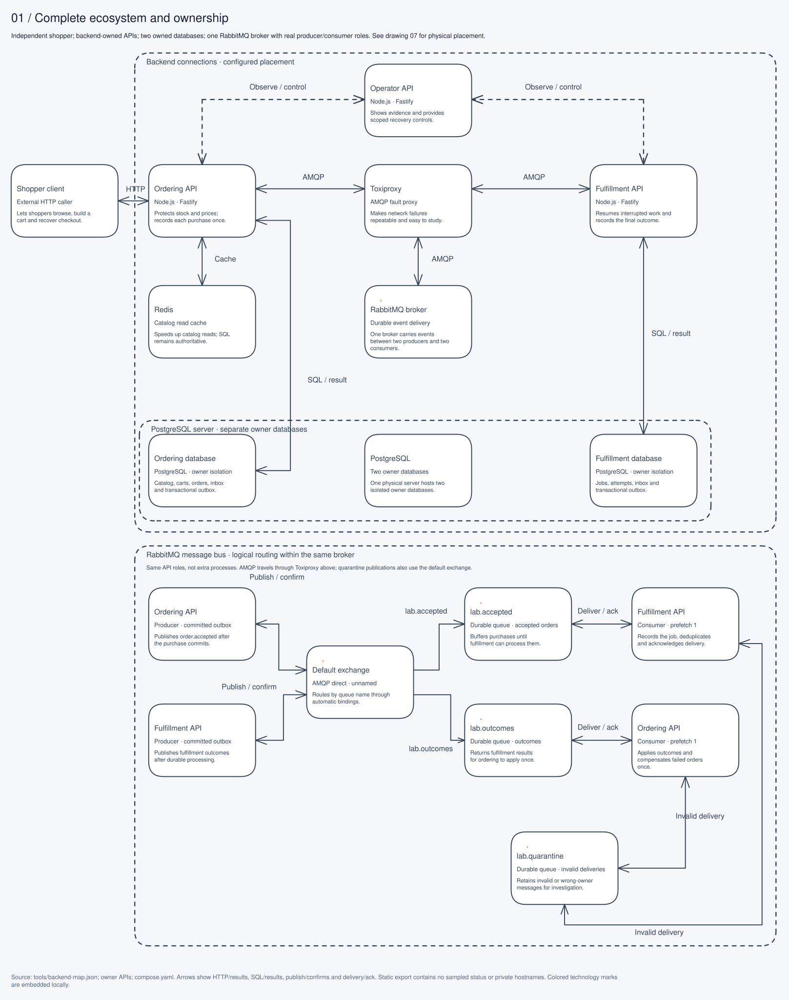

# Architecture drawings

Read the drawings in this order. Each has an editable Excalidraw scene and an SVG exported with Excalidraw 0.18.1. They describe implemented systems, with source anchors below. Planned enrichment/file-transfer systems are outside these drawings because they are not running services.

| Drawing                                                | SVG                              | Editable scene                          | Implementation                                                                     |
| ------------------------------------------------------ | -------------------------------- | --------------------------------------- | ---------------------------------------------------------------------------------- |
| High-level ecosystem and ownership                     | [View](01-ecosystem.svg)         | [Edit](01-ecosystem.excalidraw)         | apps/\*, packages/contracts, compose.yaml                                          |
| Shopping, confirmation and checkout                    | [View](02-shopping-checkout.svg) | [Edit](02-shopping-checkout.excalidraw) | apps/ordering/src/domain.ts and main.ts                                            |
| Durable fulfillment and retry process                  | [View](03-fulfillment.svg)       | [Edit](03-fulfillment.excalidraw)       | apps/fulfillment/src/domain.ts and policies.ts                                     |
| Outbox, delivery, deduplication and recovery           | [View](04-event-delivery.svg)    | [Edit](04-event-delivery.excalidraw)    | packages/runtime/src/broker.ts                                                     |
| Cache read, invalidation and failure paths             | [View](05-catalog-cache.svg)     | [Edit](05-catalog-cache.excalidraw)     | apps/ordering/src/catalog-cache.ts, migrations/ordering/002.cjs                    |
| Operator, shoppers, fault controls and observations    | [View](06-operator-controls.svg) | [Edit](06-operator-controls.excalidraw) | apps/operator/src/main.ts, tools/feeder.ts, tools/experiments.ts                   |
| Application host, physical remote host and Linux guest | [View](07-two-host-vm.svg)       | [Edit](07-two-host-vm.excalidraw)       | infrastructure/ecommerce-lab.lima.yaml.template, compose.yaml, tools/operations.ts |

## High-level design

Blue paths carry HTTP requests/responses and event messages; green paths carry persistence/cache operations; purple paths carry named controls. Orange annotations identify failures, uncertainty and recovery. Protocol/port labels in the deployment drawing distinguish guest-internal connectivity from forwarded host ports. IDs and timestamps are data, not aggregate metric labels.

## Read a detailed diagram alongside a tutorial

1. Follow [one shopping journey](../learning-path.md) and match its request/correlation ID to recorded activity.
2. Read the checkout drawing left-to-right on the top row, then right-to-left on the bottom row. The commit box contains all writes in the checkout transaction. Validation failures preserve the cart.
3. Read fulfillment the same way. A retry returns to pending work with its persisted deadline; restart resumes an existing attempt.
4. Use the transport drawing to distinguish a lost HTTP response, lost publisher confirmation and lost consumer acknowledgment. Their recovery routines differ.
5. For the guest drawing, trace PostgreSQL traffic, AMQP through the proxy, Redis reads/fills and SSH lifecycle/configuration separately. HTTP observations use forwarded owner/management ports.

## Edit and export

1. Open your Excalidraw editor. Use its **Open** action to load the `.excalidraw` file from your local checkout; the scene contains only public architecture text and no environment values or credentials.
2. Move a component and its arrows, then edit ownership, stack, input/output data and failure behavior together. Keep consistent spacing; use explicit direction labels for replies/outcomes.
3. Save the edited `.excalidraw` under the same name in `docs/diagrams/`.
4. Use **Export image → SVG**, include the white background, and replace the corresponding `.svg`. Keep both files in the same change. SVG exports are the rendered reference; scene files remain editable.
5. Open the SVG in a browser at normal size and check every label, connector and boundary for clipping/overlap. Confirm the drawing against the source anchors and current defaults. Add new systems only after their contracts and ownership exist.
6. Run `pnpm format:check` and `pnpm check:public`; review the file diff before release. Do not copy private `.env`, real network addresses, SSH identities or local machine paths into a drawing.

The original scenes were built through Excalidraw's element conversion API and exported with `exportToSvg`; element counts were checked after JSON round-trip/restoration. Layout was inspected in a local browser. SVG rendering is static documentation, not live telemetry. The dashboard's Architecture tab remains the surface for polled, correlated observations.

API references: [Excalidraw element creation](https://docs.excalidraw.com/docs/@excalidraw/excalidraw/api/excalidraw-element-skeleton), [SVG export](https://docs.excalidraw.com/docs/@excalidraw/excalidraw/api/utils/export). Resource controls and measured limits: [capacity guide](../resource-capacity.md).
