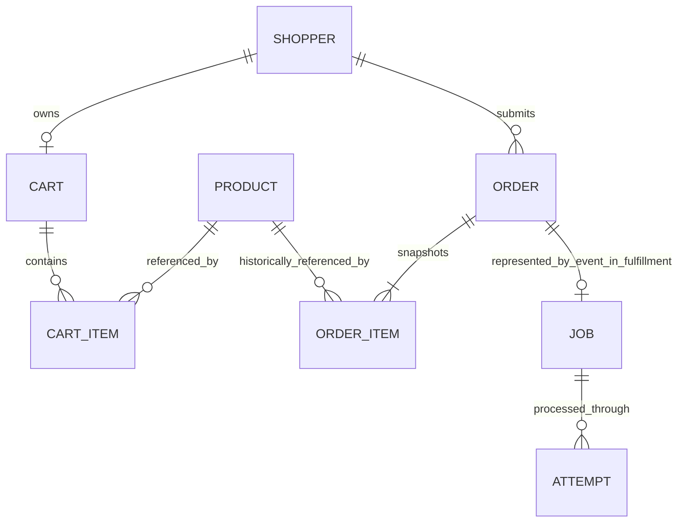

# Ontology and learning map

An ontology is the set of concepts and relationships the lab uses to explain its world. It is more than table names: it distinguishes records, commands, facts, attempts and observations so a learner can reason about what actually happened.

Shopper is an anonymous identity, not an account. Product is mutable inventory. Cart is an editable intention. Preview is an observation, not a reservation. Checkout acceptance is a command. Order is a durable accepted purchase with item snapshots. Job is independently owned fulfillment work. Attempt is one persisted processing try. Event is a recorded fact. Outbox is pending publication; inbox is recorded consumption. Operator action is a named operational command. A metric/log entry is evidence, not the authoritative business record. The order/job relationship crosses an event contract, not a database foreign key.

| Original learning goal                                          | Group 1 learning path                                                                                    |
| --------------------------------------------------------------- | -------------------------------------------------------------------------------------------------------- |
| 1. End-to-end collaboration                                     | Follow one correlation ID through HTTP, checkout, outbox, job and outcome                                |
| 2. Retrieval/processing/delivery                                | Compare REST reads with asynchronous fulfillment and broker acknowledgments                              |
| 3. Effective unit tests                                         | Test money/state/retry policy and HTTP contracts; integration tests verify database concurrency          |
| 4. Debugging                                                    | Use Problem Details, correlated activity and owner record drill-down                                     |
| 5. Servers/containerization                                     | Compare native Node processes with Compose dependency containers                                         |
| 6. Monitoring/events                                            | Observe request/business counters, durable jobs and the three-event taxonomy                             |
| 7. REST/wrapper                                                 | Read exported OpenAPI and packages/client's bounded retry behavior                                       |
| 8. Deep modules/abstraction/errors                              | Study ordering's checkout interface: transaction complexity stays with its owner                         |
| 9. Signup/onboarding/transactions/batch/SFTP/keys/SSH/contracts | Checkout/contracts and remote SSH setup now; signup, batch/SFTP and key exercises are deferred           |
| 10. CI/runners                                                  | Quality and ecosystem jobs execute the repo's own checks; runner hosting is a separate deployment choice |
| 11. UI/accessibility                                            | Keyboard forms, labels, status messages, light/dark theme and accessibility lint                         |
| 12. Business/product reasoning                                  | Explain the problem solved by each capability; this lab makes no market-fit claim                        |
| 13. Database/cache management                                   | Inspect two PostgreSQL owners and migrations now; Redis/cache invalidation is later                      |
| 14. Capacity/benchmarking                                       | Record live host/container observations now; repeatable benchmark/report tooling is later                |
| 15. Container orchestration                                     | Docker Compose now; Kubernetes/k3s/alternative proxies are later experiments                             |
| 16. AI development guardrails                                   | Local root guidance applies throughout the repo; shared standards remain documented in docs/             |
| 17. Ontology                                                    | Distinguish intention, transaction, fact, processing attempt and observation using this map              |

A useful teaching exercise is to pause fulfillment, accept an order, inspect the persisted job, resume processing and follow its terminal event back to ordering. Then compare a failed job's three attempts with the order's single compensation transition. Use disposable lab data and check action outcomes before repeating commands.
